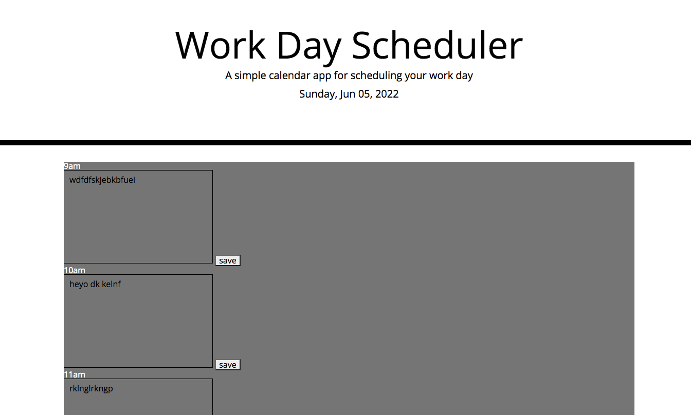

# calendar-pot-pie

## Overview

For this project I used JavaScript to create a daily work schedule with times color coded and text space with a save button.
I haven't styled the application yet that's why it looks goofi but the functionality is there.

## Tools Used:

HTML, CSS, JavaScript.

## Link:

https://chasechri.github.io/calendar-pot-pie/
